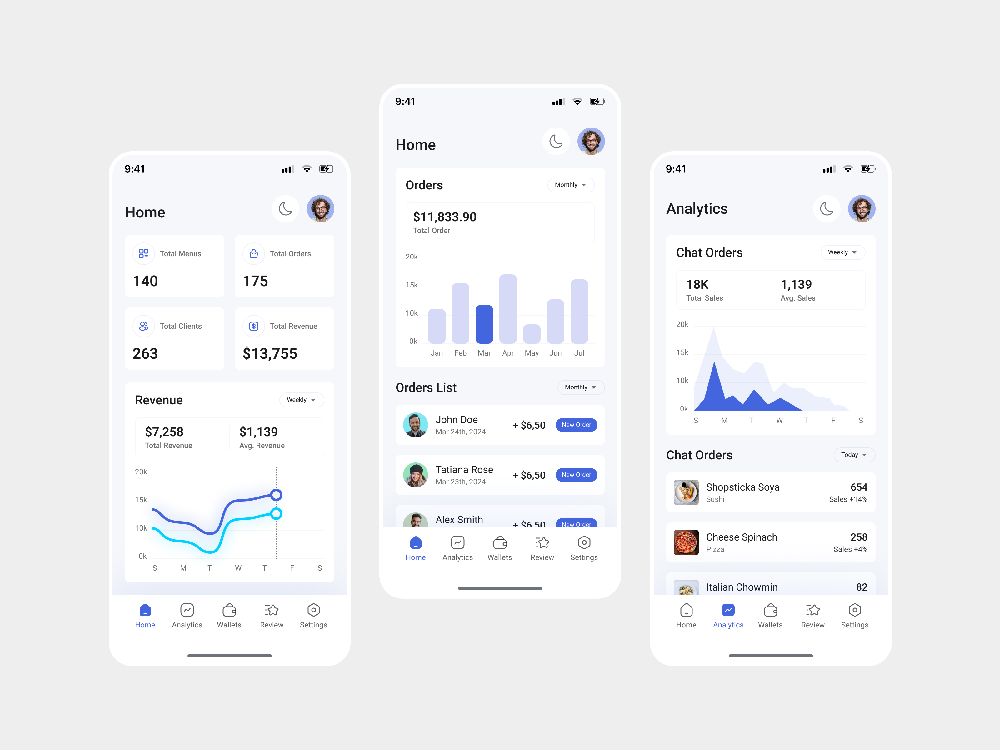

# 💘 AI Dating Coach - Complete Platform

<div align="center">
  
  
  **Transform your dating life with AI-powered insights and coaching**
  
  [](https://reactnative.dev/)
  [](https://www.typescriptlang.org/)
  [](https://supabase.com/)
  [](#license)
</div>

## 🚀 Project Overview

AI Dating Coach is a comprehensive mobile and web platform that leverages artificial intelligence to help users improve their dating success through personalized coaching, photo analysis, conversation feedback, and voice training.

### 📱 **Mobile App** (iOS & Android)
- Native React Native application
- AI-powered photo analysis
- Real-time conversation coaching
- Voice confidence training
- Three-tier subscription model

### 🌐 **Web Dashboard**
- React-based admin interface
- Analytics and insights
- User management
- Content management system

### ⚡ **Backend Infrastructure**
- Supabase database and authentication
- Edge functions for AI processing
- Stripe payment integration
- OpenAI GPT-4 Vision API

## 🎯 Key Features

### 🆓 **Spark Plan (Free)**
- 5 AI analyses per month
- Basic photo feedback
- Conversation analysis
- Progress tracking

### 💎 **Premium Plan ($19/month)**
- 25 AI analyses per month
- Advanced photo optimization
- Screen monitoring alerts
- Real-time chat suggestions

### 👑 **Elite Plan ($49/month)**
- 100 AI analyses per month
- Voice confidence coaching
- Social media analysis
- 1-on-1 coaching sessions

## 🏗️ Architecture

```
┌─────────────────┐    ┌─────────────────┐    ┌─────────────────┐
│   Mobile App    │    │   Web Dashboard │    │   Marketing     │
│  (React Native) │    │    (React)      │    │    Website      │
└─────────────────┘    └─────────────────┘    └─────────────────┘
         │                       │                       │
         └───────────────────────┼───────────────────────┘
                                 │
                    ┌─────────────────┐
                    │    Supabase     │
                    │   Backend API   │
                    └─────────────────┘
                             │
         ┌───────────────────┼───────────────────┐
         │                   │                   │
┌─────────────┐    ┌─────────────┐    ┌─────────────┐
│  OpenAI     │    │  Stripe     │    │ PostgreSQL │
│  GPT-4      │    │  Payments   │    │ Database   │
└─────────────┘    └─────────────┘    └─────────────┘
```

## 📦 Repository Structure

```
ai-dating-coach/
├── 📱 mobile/           # React Native Mobile App
├── 🌐 web/             # Web Application
├── ⚡ backend/         # Supabase Backend
├── 🎨 design/          # UI/UX Assets
├── 📚 docs/            # Documentation
├── 🏪 marketing/       # Marketing Website
├── 🔧 scripts/         # Development Scripts
└── 📄 README.md        # This file
```

## 🚀 Quick Start

### Prerequisites
- Node.js 18+
- React Native CLI
- iOS Simulator / Android Emulator
- Supabase account
- OpenAI API key
- Stripe account

### 1. Clone Repository
```bash
git clone https://github.com/YOUR_USERNAME/ai-dating-coach.git
cd ai-dating-coach
```

### 2. Setup Mobile App
```bash
cd mobile
npm install
cd ios && pod install && cd ..
npx react-native run-ios
```

### 3. Setup Web Dashboard
```bash
cd web
npm install
npm run dev
```

### 4. Configure Backend
```bash
cd backend
# Follow backend/README.md for Supabase setup
```

## 🛠️ Development

### **Mobile Development**
- **Framework**: React Native 0.75.4 with TypeScript
- **Navigation**: React Navigation 6
- **State Management**: React Context + Custom Hooks
- **UI**: React Native Elements + Vector Icons
- **Permissions**: Camera, Microphone, Storage

### **Web Development**
- **Framework**: React 18 with Vite
- **Styling**: Tailwind CSS
- **State Management**: React Query + Context
- **UI Components**: Custom component library

### **Backend Services**
- **Database**: Supabase PostgreSQL
- **Authentication**: Supabase Auth
- **Storage**: Supabase Storage (3 buckets)
- **Edge Functions**: 5 serverless functions
- **AI Integration**: OpenAI GPT-4 Vision API

## 📱 App Store Status

### **iOS App Store**
- ⚠️ 70% Ready - Missing Xcode project files
- 📋 See `mobile/APP_STORE_DEPLOYMENT_CHECKLIST.md`
- 🗓️ Timeline: 7-14 days to submission

### **Google Play Store**
- ⚠️ 70% Ready - Missing app icons and signing
- 📋 Complete Android configuration available
- 🗓️ Timeline: 7-14 days to submission

## 💰 Business Model

### **Revenue Streams**
- **Freemium Subscriptions**: $0 → $19 → $49/month
- **In-App Purchases**: Additional analysis credits
- **Enterprise**: Custom coaching packages

### **Market Size**
- **TAM**: $8.2B global dating services market
- **Target**: 22-35 year old professionals
- **Pricing**: Premium positioning vs. competitors

## 🔐 Security & Privacy

### **Data Protection**
- End-to-end encryption for sensitive data
- Row Level Security (RLS) in database
- GDPR and CCPA compliant
- Secure API key management

### **Privacy Features**
- User data anonymization
- Opt-out data deletion
- Transparent privacy policy
- Minimal data collection

## 📊 Analytics & Monitoring

### **User Analytics**
- Feature usage tracking
- Conversion funnel analysis
- Retention metrics
- A/B testing framework

### **Business Intelligence**
- Revenue tracking
- User acquisition costs
- Lifetime value analysis
- Churn prediction

## 🤝 Contributing

We welcome contributions! Please see [CONTRIBUTING.md](./CONTRIBUTING.md) for guidelines.

### **Development Workflow**
1. Fork the repository
2. Create feature branch (`git checkout -b feature/amazing-feature`)
3. Commit changes (`git commit -m 'Add amazing feature'`)
4. Push to branch (`git push origin feature/amazing-feature`)
5. Open Pull Request

## 📄 License

This project is proprietary software. All rights reserved.

For licensing inquiries, please contact: [contact@aidatingcoach.com](mailto:contact@aidatingcoach.com)

## 🌟 Team

**Built with ❤️ by MiniMax Agent**

- 🤖 AI Development: Advanced machine learning integration
- 📱 Mobile Development: React Native expertise
- 🌐 Web Development: Modern React applications
- ⚡ Backend Development: Scalable cloud architecture

## 📞 Contact & Support

- **Website**: [https://aidatingcoach.com](https://aidatingcoach.com)
- **Email**: [support@aidatingcoach.com](mailto:support@aidatingcoach.com)
- **Documentation**: [./docs/](./docs/)
- **Issues**: [GitHub Issues](https://github.com/YOUR_USERNAME/ai-dating-coach/issues)

---

<div align="center">
  <strong>Ready to transform your dating life? 💘</strong>
  <br>
  <em>Start your journey with AI Dating Coach today!</em>
</div>